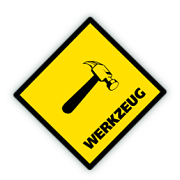

 <!-- .element: style="border: none;box-shadow: 0 0 0" -->

 

- Ferramentas para WSGI <!-- .element: class="fragment" data-fragment-index="1" -->

 

- Tratamento de requisição e resposta <!-- .element: class="fragment" data-fragment-index="2" -->

 

- Sistema de roteamento <!-- .element: class="fragment" data-fragment-index="3" -->
